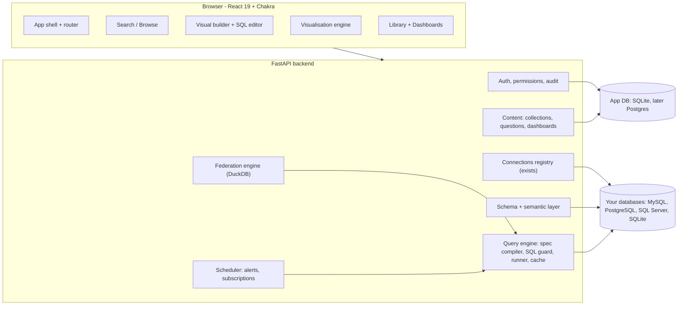
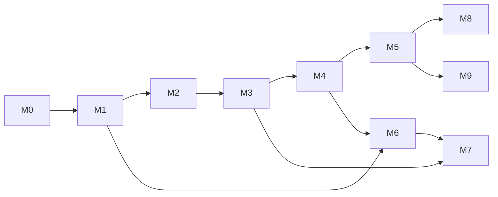

# Ncode → data work & analysis platform

**Status:** agreed plan v1 · M0 and M1 delivered, both waiting for their checklists · **Owner:** Mark · **Last updated:** 2026-10-10

This document is the single source of truth for where Ncode is going. It contains the
analysis of the *DataDesk* low-code project ("Low-code-draft"), what we borrow from it, the
target architecture, and the milestone plan we will stick to. Changes to the plan are recorded
in the [changelog](#14-changelog) at the bottom.

---

## 1. Vision

Ncode today answers *"where is this value in my database?"* (search, browse, export).
The goal is to grow it into a **self-hosted data work and analysis platform in the spirit of
Metabase Pro**, for people who work with several different databases:

| Pillar | What the user can do |
|---|---|
| **Explore** (exists) | Search every table, browse rows, export CSV |
| **Ask** | Build questions visually (no SQL) or write SQL, with safe, fast, cancellable execution |
| **Visualise** | Turn any result into charts, KPI cards, pivot tables; format and style them |
| **Combine** | Join results across databases and uploaded files |
| **Organise & share** | Save questions into collections, build dashboards with filters, share and schedule |
| **Understand** | Profile columns, auto-explore tables, period-over-period and statistical tools, a semantic layer (models, metrics, field metadata) |

*Metabase is our product inspiration only. Its code is AGPL and we do not copy it; everything
here is designed and written for Ncode.*

**Non-goals (for now):** writing/editing data (Ncode stays read-only) · arbitrary Python/R
notebooks (remote code execution risk; revisit sandboxed) · ETL pipelines · streaming/real-time
· mobile apps.

---

## 2. Baseline: what Ncode already has

Python/FastAPI + SQLAlchemy backend, React 19 + Chakra v2 frontend. Multi-engine support
(MySQL, MariaDB, PostgreSQL, SQL Server, SQLite), connections managed in the UI with encrypted
passwords, login with roles + per-user connection access + audit log, search across all tables,
table browser with paging/sort/filter, CSV streaming export, light/dark theme, tests.

All of that stays and keeps working; the new platform is built on top of it.

---

## 3. What DataDesk contains

DataDesk is a Node/TypeScript (Express + Knex + MySQL) backend with a React 18 frontend,
≈4,500 lines in total.

| Area | How it works | Verdict |
|---|---|---|
| **Structured query spec** | JSON spec `{database, from, joins, select[+aggregate], where (nested AND/OR groups), groupBy, orderBy, limit}` validated with zod and compiled to SQL by Knex. Every table/column name is checked against a cached schema (whitelist); values are bound parameters. | **Best idea in the project.** |
| **Schema metadata** | Reads `information_schema` (MySQL only), maps DB types to `string/number/date/datetime/boolean`, collects primary and foreign keys, 5-minute cache, manual refresh. | Good concept; we already have a multi-engine cache, we extend it. |
| **Auto joins** | Frontend finds the join condition from foreign keys between the main table and each added table. | Good UX; limited to *direct* FKs (see §4). |
| **Filter builder** | Type-aware operator sets (text / numeric+date / boolean), `between`, `in`, `isNull`, AND/OR switch. Backend supports nested groups, UI is flat. | Port the operator logic, expose nested groups. |
| **Aggregations** | count / sum / avg / min / max, auto `GROUP BY` of non-aggregated fields. | Good base; extend. |
| **SQL mode** | Single read-only statement, wrapped as a sub-select to force `LIMIT`, query timeout, schema tree where a click inserts a name, Ctrl+Enter to run. | Keep the UX and the wrap-for-limit trick; replace the guard (see §4). |
| **Cross-DB report** | Up to 5 sources run independently and are merged **in memory** on a key column; columns are prefixed with the source label. | Right need, weak implementation; rebuild on DuckDB (M6). |
| **Charts** | Table, bar, line, area, pie, KPI number; the chosen axes are saved with the report (`chart_config`); palette of 6 colours. | Keep the concepts (saved axis config, KPI card, palette); richer engine. |
| **Saved reports / dashboards** | Reports store `spec_json` + chart type + kind (`single`, `multi`, `sql`). A dashboard is just a list of report IDs shown in an auto-fit grid; each card runs its own query. | Needs a real model: layout, filters, text cards, permissions. |
| **Messy-date normaliser** | `tryNormalizeDate` recognises ISO, `DD.MM.YYYY` and unix timestamps *per value*, because MES/LES/IoT systems mix formats inside one column. | **Hidden gem** for real-world data: becomes a "parse as date" column option (M7). |
| **UX bits** | Resizable split pane, "show generated SQL" with copy, CSV export with BOM, sidebar layout, chart colour palette. | Reuse the ideas. |
| **Auth** | One seeded user, JWT, bcrypt, no roles, no ownership checks. | **Not borrowed** — Ncode's auth is stronger. |

---

## 4. Defects found in DataDesk (we will not copy these)

Checked by reading the code; items marked ✔ were also reproduced.

1. **SQL guard is a regex blacklist.** ✔ `SELECT LOAD_FILE('/etc/passwd')` and `SELECT SLEEP(25)` pass it (`\bLOAD\b` does not match `LOAD_FILE`), while legitimate queries are rejected: ✔ `REPLACE(name,'a','b')`, ✔ any string literal containing "update", ✔ a column named `set`. Comment stripping is naive: ✔ `'#fff'` inside a literal is cut off. → Replace with a real SQL parser (M1).
2. **Cross-DB merge silently loses data.** Rows are merged in a `Map` keyed by the key value; if a source returns several rows per key (orders per customer), later rows overwrite earlier ones. No join types (always a full merge), no multi-column keys, no report of unmatched keys. → DuckDB joins with unmatched-key statistics (M6).
3. **Auto-join only finds a *direct* FK** between the main table and the added table. Otherwise the join is silently dropped and the query fails later. → Find join paths through the FK graph, allow manual relationships (M1/M2).
4. **`ORDER BY` uses the raw column**, not the aggregate alias, which breaks (or changes meaning) in grouped queries; no `HAVING`, no distinct count, no date bucketing ("by month"), no computed columns. → Richer spec (M1).
5. **`LIKE` wildcards are not escaped** (`%` and `_` typed by a user act as wildcards). → Escape (Ncode already does this in search).
6. **No ownership or permissions on reports/dashboards** — any logged-in user can edit or delete anything. → Collections + permissions (M4).
7. **Dashboards cannot be filtered**, have no layout, no refresh, no caching. → M5.
8. **MySQL only**, credentials only via `.env`. → Ncode already solved this.
9. **Auth smells:** default JWT secret fallback, unauthenticated change-password endpoint without throttling. → Not applicable (Ncode's login has lockout and server-side sessions).
10. **No tests.**

---

## 5. Target architecture



### Design principles

1. **Everything is a Question.** A question is a builder spec, a SQL text, or a federated plan.
   All three run through the same runner and return the same *result envelope*.
2. **Specs are data.** JSON, versioned (`"version": 1`), validated with Pydantic, whitelisted
   against the schema, never concatenated into SQL.
3. **Safe by construction.** Read-only sessions, parser-based SQL guard, hard row limits,
   statement timeouts, per-user concurrency limits, audit log.
4. **Results carry column metadata** (name, type, role). Charts, formatting and auto-viz depend on it.
5. **Async with cancel.** Long queries run as tasks with progress and cancel (the search task
   infrastructure is reused). Results are cached with a TTL.
6. **Never break what exists.** Search, Browse and Export keep working through every milestone.
7. **Testable offline.** Query compilation is tested per dialect without a database
   (MySQL / PostgreSQL / SQL Server / SQLite golden SQL) plus execution tests on SQLite.

### Quality bar

Compile a spec in < 50 ms · builder preview returns in < 2 s on an indexed table · UI keyboard
accessible · every milestone ships tests and a manual checklist · no secret ever in the repo.

---

## 6. Core contracts (sketches — final shapes are fixed in M1/M3)

**QuerySpec v1** (successor of DataDesk's spec)

```json
{
  "version": 1,
  "connection": "mes",
  "source": { "table": "orders" },
  "joins": [
    { "table": "customers", "type": "left",
      "on": [{ "left": "orders.customer_id", "right": "customers.id" }] }
  ],
  "fields": [],
  "aggregations": [
    { "fn": "sum",            "ref": "orders.total",       "alias": "revenue" },
    { "fn": "count_distinct", "ref": "orders.customer_id", "alias": "buyers"  }
  ],
  "breakouts": [
    { "ref": "orders.created_at", "bucket": "month" },
    { "ref": "customers.region" }
  ],
  "filters": { "op": "and", "rules": [
    { "ref": "orders.status", "op": "=", "value": "paid" },
    { "ref": "orders.created_at", "op": "between", "value": ["2026-01-01", "2026-12-31"] },
    { "op": "or", "rules": [ { "ref": "customers.region", "op": "in", "value": ["EU", "US"] } ] }
  ]},
  "having": [{ "ref": "revenue", "op": ">", "value": 1000 }],
  "order": [{ "ref": "revenue", "dir": "desc" }],
  "limit": 1000
}
```

**Result envelope** (rows as arrays: smaller payload, duplicate column names are possible)

```json
{
  "columns": [ { "name": "month", "type": "date", "role": "dimension" },
               { "name": "revenue", "type": "number", "role": "measure" } ],
  "rows": [ ["2026-01-01", 1200.5], ["2026-02-01", 980.0] ],
  "stats": { "duration_ms": 84, "row_count": 2, "truncated": false, "cached": false },
  "sql": "SELECT ..."
}
```

**VizSpec** (renderer-independent, stored with the question)

```json
{ "type": "combo", "x": "month",
  "series": [ { "y": "revenue", "kind": "bar", "axis": "left" },
              { "y": "buyers",  "kind": "line", "axis": "right" } ],
  "stack": false, "labels": false, "goal": null, "palette": "default",
  "format": { "revenue": { "style": "currency", "currency": "USD", "compact": true } } }
```

**Dashboard card**

```json
{ "kind": "question", "question_id": 12, "layout": { "x": 0, "y": 0, "w": 6, "h": 4 },
  "viz_override": null, "param_map": { "region": "filter:region", "date": "filter:period" } }
```

---

## 7. App database (additions)

Existing: `users`, `sessions`, `connections`, `audit_log`. Managed by **Alembic** migrations
from M0 on (DataDesk patched its schema with `try { ALTER TABLE }`; we won't).

| Table | Milestone | Purpose |
|---|---|---|
| `collections` | M4 | Folders (tree), owner |
| `questions` | M4 | name, collection, connection, `kind` (builder / sql / federated), `spec` JSON, `viz` JSON, owner, timestamps, archived |
| `permissions` | M4 | collection × (user or role) → view / edit |
| `favorites` | M4 | per-user stars |
| `dashboards`, `dashboard_cards` | M5 | layout, filters (JSON), tabs, card kinds (question / text / heading) |
| `datasets` | M6 | uploaded files: name, path, columns, row count |
| `field_metadata` | M7 | per column: display name, description, semantic type, format, hidden, parse-as-date |
| `models`, `metrics` | M7 | saved question as virtual table; named aggregation |
| `subscriptions`, `alerts` | M8 | schedule, recipients, thresholds |
| `share_links` | M8 | signed, expiring, read-only links |

---

## 8. Milestones

Size: **S** ≈ 1 delivery · **M** ≈ 2 · **L** ≈ 3–4 (a "delivery" = one pushed batch of commits, formerly a zip).
Order is fixed; M0–M5 form **release v1.0 "Analytics core"**.

| Milestone | Status |
|---|---|
| M0 | Delivered on branch `claude/charming-fermi-jknknw`; checklist: [docs/checklists/M0.md](checklists/M0.md) (deferred by Mark) |
| M1 | Delivered on the same branch; checklist: [docs/checklists/M1.md](checklists/M1.md) |
| M2–M9 | Not started |



### M0 · Foundations — S/M

- **Frontend:** `react-router-dom` (routes: `/`, `/search`, `/browse`, `/questions`, `/sql`, `/dashboards`, `/admin`),
  new app shell and navigation, lazy-loaded routes, TanStack Query for server state.
- **Backend:** Alembic migrations; **schema v2** endpoint (types normalised to
  string/number/date/datetime/boolean/json, primary keys, foreign keys, FK graph) on top of the existing cache;
  the result envelope + column-type helper.
- **Borrowed:** type mapping and FK idea from `metadataService.ts`.
- **New deps:** `react-router-dom`, `@tanstack/react-query`, `alembic`.
- **Done when:** Search/Browse/Export work exactly as before inside the new shell; `GET …/schema` returns FKs; migrations apply on a fresh and on an existing app DB.

### M1 · Query engine & SQL mode (backend) — L

- **`query/spec.py`** Pydantic QuerySpec v1.
- **`query/compiler.py`** spec → SQLAlchemy `Select`: whitelist, type-aware operators, `LIKE` escaping, nested filter groups,
  aggregations incl. count-distinct, `HAVING`, order by alias, **date bucketing and numeric binning per dialect**,
  joins with **path-finding over the FK graph** plus manual override, simple expressions (arithmetic, `coalesce`, `case`).
- **`query/sqlguard.py`** parse with **sqlglot** (dialect per engine): exactly one statement, root is `SELECT`/`WITH`/`UNION`,
  no DML/DDL/commands, no `SELECT … INTO`, no locking clauses, per-dialect denylist of dangerous functions
  (`LOAD_FILE`, `SLEEP`, `BENCHMARK`, `pg_sleep`, `pg_read_file`, `lo_import`, `xp_cmdshell`, `OPENROWSET`, …),
  optional table allow-list (system schemas hidden unless admin), `{{param}}` → bound parameters.
- **`query/runner.py`** thread pool execution, row cap per engine (replaces wrap-for-limit, see changelog), statement timeout, task with cancel, TTL result cache
  (permission is checked before cache lookup), audit entries, per-user concurrency limit.
- **Endpoints:** `POST /api/query`, `POST /api/query/sql`, `POST /api/query/compile` (SQL without running), task status/cancel.
- **Borrowed:** whitelist approach, spec shape, wrap-for-limit, limits (`MAX_ROW_LIMIT`, timeout), operator set, FK join inference.
- **Tests:** golden SQL for 4 dialects, SQLite execution, a guard suite that includes every DataDesk failure from §4 as a regression test.
- **New deps:** `sqlglot` (pinned `>=30.19,<31`).
- **Done when:** all tests pass; a grouped, joined, bucketed query runs through `/docs`; `LOAD_FILE`/`SLEEP` are rejected and `REPLACE()` is accepted.

### M2 · Visual builder & SQL editor (UI) — L

- **Notebook-style builder:** Data → Join → Filter → Summarise → Sort → Limit; field picker with aggregations;
  filter builder with **nested groups** and relative dates; breakout with date bucket; custom columns;
  FK-suggested joins; debounced live preview; **View SQL / Convert to SQL**.
- **SQL editor:** CodeMirror 6 with schema-aware autocomplete, schema tree (click to insert), Ctrl/Cmd+Enter,
  run selection, `{{param}}` inputs, local history, formatter, resizable panes.
- **Results table v2:** virtualised, resizable columns, copy cell, type-aware formatting, optional smart-date rendering.
- **Borrowed:** `FilterBuilder` operator logic, `FieldSelector`, `buildQuerySpec` FK logic, `SqlPreview`, `ResizableSplit`, SQL page UX.
- **New deps:** CodeMirror 6 packages, `react-resizable-panels`, `@tanstack/react-virtual`, `sql-formatter`.
- **Done when:** a non-SQL user builds "revenue by month by region" in under a minute and opens it as SQL.

### M3 · Visualisation engine — L

- **VizSpec + renderer (Apache ECharts, tree-shaken):** table, bar/column (grouped, stacked, 100 %, horizontal),
  line, area (stacked), combo with dual axis, pie/donut, scatter/bubble, KPI (value, delta, sparkline), gauge,
  pivot table, histogram, heatmap, funnel.
- **Auto-viz:** suggest a chart from the result shape (one number → KPI; date + number → line; category + number → bar; …).
- **Settings panel:** axes, series, colours, labels, goal line, legend, "top N + other".
- **Formatting engine:** numbers (thousands, decimals, compact, currency, percent), dates, per-column overrides.
- **Export:** PNG/SVG; CSV; **XLSX** (streamed by the backend).
- **Borrowed:** saved axis config, KPI card, chart palette (with dark variants), axis-guessing heuristics.
- **New deps:** `echarts` (thin own wrapper), `xlsxwriter` (backend).
- **Done when:** every chart type renders from fixtures; VizSpec round-trips; light and dark themes look right.

### M4 · Library: questions, collections, sharing, importer — M

- Collections tree, save / save as / duplicate / move / archive, favourites, search, ownership checks,
  collection permissions (view / edit) per user and role.
- Question parameters (SQL `{{vars}}`; builder filters can be exposed) — prerequisite for dashboard filters.
- **DataDesk importer:** `python -m app.manage import-datadesk app-data.sqlite --map db1=mes,db2=crm` converts
  reports (`single` → builder spec, `sql` → SQL question, `multi` → pending federated question) and dashboards;
  `--dry-run` first; a report lists what could not be converted.
- **Done when:** create / save / open / share round-trips; permission tests pass; importer dry-run works on a fixture built from DataDesk's schema.

### M5 · Dashboards v2 — L → **release v1.0**

- Drag-and-resize grid, edit mode, tabs; cards: question, text/markdown, heading.
- **Dashboard filters** (date range, text, category list, number) mapped to question parameters or to fields;
  defaults; filter state in the URL.
- Auto-refresh (off / 30 s / 1 m / 5 m), fullscreen "TV" mode, per-card loading and error states,
  parallel loading with a concurrency cap and cache, open-in-editor, per-card export, print/PDF stylesheet.
- **Borrowed:** the card concept (each card runs its saved question), fallback axis guessing.
- **New deps:** `react-grid-layout` (React 19 peer compatibility checked at the start of the milestone).
- **Done when:** a dashboard with 6 cards and 2 filters keeps its layout, refreshes, and respects permissions.

### M6 · Federated workspace & datasets — L

- DuckDB in-process engine (fallback: in-memory SQLite). Sources: saved question results, ad-hoc SQL results,
  uploaded **CSV / XLSX / Parquet** (type inference, row cap).
- **Visual join builder:** inner / left / right / full, multi-column keys, key coercion,
  **"37 % of keys have no match"** statistics; plus SQL over the sources; post steps (aggregate, pivot).
- **Safety:** memory/row caps, timeouts, DuckDB external access disabled and configuration locked, sqlglot guard.
- Replaces DataDesk's "multi" reports (importer finalised).
- **New deps:** `duckdb` (verified to install on your Python before the milestone starts).
- **Done when:** MES and LES results join on VIN with an unmatched-keys report, saved as a question, shown on a dashboard.

### M7 · Analysis toolkit & semantic layer — L

- **Profiling:** per column (nulls, distinct, min/max/mean/median/stddev/percentiles, top values, histogram);
  sample-based table profile with a cost guard. **X-ray:** auto-generated dashboard for a table or question.
- **Transforms:** period-over-period (MoM/YoY), % change, running total, moving average, rank, percent of total
  (SQL window functions per dialect, or DuckDB).
- **Statistics:** correlation matrix, outlier flags (IQR / z-score), trend line and simple forecast as chart overlays.
- **Semantic layer:** field metadata (display name, description, semantic type, format, hidden),
  **parse-as-date** using DataDesk's multi-format normaliser, **Models** (saved question as a virtual table),
  **Metrics** (named, reusable aggregations), manual relationships for databases without foreign keys.
- **Done when:** profile a column, X-ray a table, define a metric and use it in a question and a dashboard.

### M8 · Automation & sharing — M

- Scheduler (APScheduler): dashboard/question **subscriptions** by email and webhook (Slack / Teams / Telegram),
  **alerts** (threshold, "rows > 0"), scheduled exports.
- **Public links** (signed, expiring, read-only, optional password) and signed **embedding**; security review before release.
- Usage analytics and slow-query log (admin).

### M9 · Admin & production — M (Docker deliberately deferred)

- Users/groups admin UI with group permissions, audit viewer, row-level security (per-group column filters),
  SSO (OIDC / LDAP), app-DB backup/restore, metrics and health.
- **Docker Compose + HTTPS (Caddy)**, GitHub Actions CI (pytest, type-check, build, lint), i18n (EN / RU), docs site.

---

## 9. Working agreement

1. **One milestone at a time.** We start the next only when the previous one passes the checklist.
2. **Every delivery contains** code, tests, migration notes, README/ROADMAP updates and a short manual checklist.
3. **I state what I could and could not verify.** Since M0 I work in a cloud environment that can install packages and run `pytest`, `npm run build`, lint and a headless-browser smoke test against SQLite. It cannot reach your databases and runs Python 3.13, so you still run the checklist on your machine (Python 3.14, real MySQL / PostgreSQL / SQL Server); I fix what fails before moving on.
4. **Dependency check first.** At the start of each milestone I list the new packages; you run one install command so wheel/compatibility problems appear *before* we build on them.
5. **No regressions:** Search, Browse and Export are re-tested in every milestone.
6. **Security first:** read-only access, whitelists, parser-based guards, no string-built SQL, secrets only in env or the encrypted store, audit everything that touches data.
7. **Scope control:** new ideas go to the parking lot (§12); the plan changes only through the changelog.
8. **Git:** one branch per milestone, tag `m0` … `m9` when it passes; `v1.0` after M5.

---

## 10. Decisions taken (defaults — change before M0 starts, not after)

| # | Decision | Alternative considered |
|---|---|---|
| D1 | Backend stays **Python/FastAPI**; DataDesk's logic is re-implemented, the Node code is not merged | Run both backends |
| D2 | Charts with **ECharts** (more chart types, theming, canvas performance) behind a renderer-independent `VizSpec` | Recharts (lighter, fewer types) |
| D3 | Federation on **DuckDB**, in-memory SQLite as fallback | pandas / polars |
| D4 | Result rows as **arrays + column metadata** | Row objects like DataDesk |
| D5 | App DB **SQLite + Alembic** (Postgres option later) | Postgres from day one |
| D6 | **DataDesk importer** included in M4 | Start clean |
| D7 | UI stays **English**; EN/RU i18n in M9 | i18n from M0 |
| D8 | UI kit stays **Chakra v2**; DataDesk's inline styles are not carried over (its palette and sidebar look are merged into our theme tokens) | — |

---

## 11. Risks

| Risk | Mitigation |
|---|---|
| My environment cannot reach your databases (and is Python 3.13, not 3.14) | Tests, build and browser checks run in my environment; per-dialect golden SQL; you run the checklist against the real databases |
| Dialect differences (date bucketing, windows, paging) | Golden SQL per dialect, a documented feature matrix, graceful "not supported on X" |
| Heavy queries on production DBs | Always `LIMIT`, timeouts, concurrency limits, sampling for profiling, cost hints |
| Growing attack surface (SQL mode, federation, public links, embedding) | Parser-based guard, read-only everywhere, threat model per milestone |
| Bundle size (ECharts, CodeMirror) | Lazy routes, tree-shaking, size budget |
| Python 3.14 wheel availability (duckdb, drivers) | Dependency check at the start of each milestone |
| Scope creep | Parking lot + changelog |

## 12. Parking lot (not scheduled)

Sandboxed Python notebooks · Oracle / ClickHouse / BigQuery / Snowflake adapters · cross-filtering by
clicking charts · question version history and diff · geographic maps · data quality rules and monitors ·
natural-language questions (LLM) · mobile layout polish.

---

## 13. Appendix — where each DataDesk file goes

| DataDesk | Ncode target |
|---|---|
| `validators/querySpec.ts`, `types/schema.ts` | `backend/app/query/spec.py` |
| `services/queryBuilderService.ts` | `backend/app/query/compiler.py` |
| `services/sqlQueryService.ts` | `backend/app/query/sqlguard.py` + `runner.py` |
| `services/multiQueryService.ts`, `CrossDbReportPage.tsx`, `SourceBuilder.tsx` | `backend/app/federation/` + federated builder UI (M6) |
| `services/metadataService.ts` | `backend/app/db.py` (schema v2) |
| `db/appDb.ts`, `routes/reports.ts`, `routes/dashboards.ts` | `backend/app/content/` (M4, M5) + Alembic |
| `middleware/auth.ts`, `routes/auth.ts`, `config/databases.ts` | *not borrowed* (Ncode already has better) |
| `utils/buildQuerySpec.ts` | `frontend/src/query/specBuilder.ts` (+ FK path search) |
| `components/FilterBuilder.tsx`, `FieldSelector.tsx` | `frontend/src/components/query/` (rebuilt in Chakra) |
| `pages/SqlEditorPage.tsx` | `frontend/src/pages/SqlEditor.tsx` (CodeMirror) |
| `components/ChartView.tsx` | `frontend/src/viz/` (ECharts; same config semantics) |
| `components/ResultsTable.tsx`, `utils/dateFormat.ts` | `components/data/ResultsTable.tsx`, `lib/format.ts`, parse-as-date (M7) |
| `components/SqlPreview.tsx`, `ResizableSplit.tsx` | "View SQL" popover, `react-resizable-panels` |
| `DashboardReportCard.tsx`, `DashboardDetailPage.tsx` | `frontend/src/dashboards/` (M5) |
| `utils/csvExport.ts` | already in Ncode (`lib/csv.ts`) |
| `styles/theme.css` palette | Chakra theme tokens (`theme.ts`) |

---

## 14. Changelog

| Date | Change |
|---|---|
| 2026-10-09 | Plan v1 created from the DataDesk analysis |
| 2026-10-10 | Ncode v5 imported as the baseline (fixes: one wrong test, `framer-motion` 6 → 11 for React 19 types, lint errors, leftover files removed) |
| 2026-10-10 | M1 started before the M0 checklist was run (Mark's call); M0 checklist findings are fixed alongside later work. M1 stays on the same branch as M0 (the session's designated branch), tags `m0`/`m1` once the checklists pass |
| 2026-10-10 | M1 delivered. Decisions: (1) SQL mode does **not** wrap the user's SQL in a sub-select (that breaks `ORDER BY`/`WITH` on SQL Server); rows are capped per engine instead: PostgreSQL server-side cursor (which also refuses a 2nd statement), MySQL `sql_select_limit`, SQL Server `SET ROWCOUNT`, SQLite lazy fetch. (2) The guard adds MySQL-specific checks because sqlglot and MySQL read comments differently (`--1` and `/*! */`); MySQL sessions turn off `NO_BACKSLASH_ESCAPES` for the same reason. (3) Join types are inner/left/full; right joins are left out (swap the tables). (4) Relative date filters (`last`, `current`) moved forward from M2 into the spec. (5) MySQL vs MariaDB is detected from the server, not the label, so timeouts always apply. Verified on PostgreSQL 16, MariaDB 10.11 and SQL Server 2022 as well as SQLite |
| 2026-10-10 | M0 delivered. Additions beyond the plan: an Admin → *Data model* screen that shows schema v2, and `find_join_path` (FK-graph path search) moved forward from M1 because the graph module needed it to be testable. Working agreement item 3 updated: my environment can now run the tests, build and a browser check |
